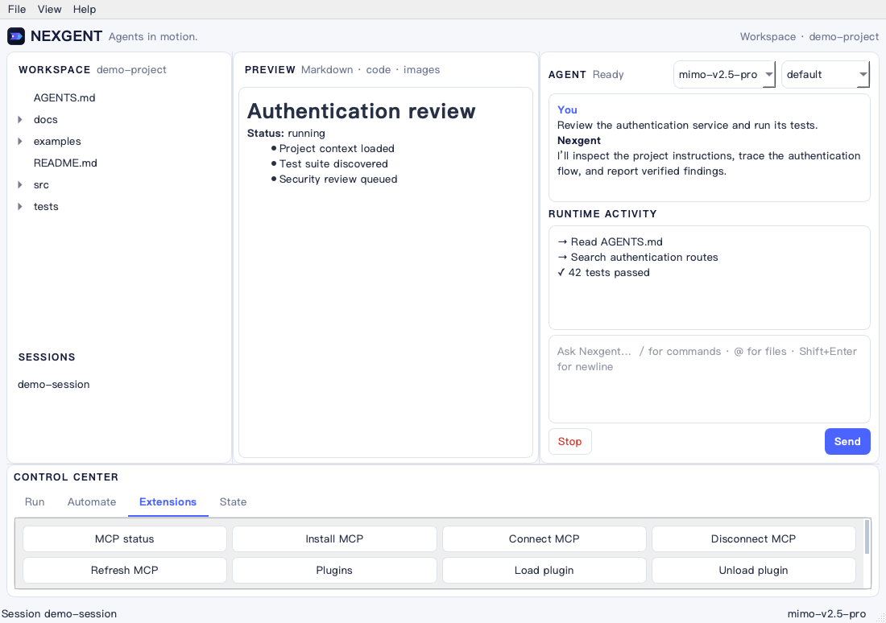

Nexgent 是面向长周期科研代码与模拟任务的可追踪、自排查、自进化 Coding Harness。
它让 Agent 在真实仓库中修改代码、配置和模拟参数，同时把执行、故障、恢复与验收证据
保存为可继续、可检查、可导出的持久 Run。

> A traceable, self-diagnosing and evolving Coding Harness for long-running
> research code and simulation tasks.

## 功能

- **验证驱动闭环**：以用户提供的测试或模拟验收命令作为唯一成功条件；普通模型回答
  不会被当作任务完成。
- **持久追踪**：记录目标、attempt、模型和工具事件、进程、代码/配置变化、产物、
  依赖边、诊断、恢复和验证结果。
- **自动排查**：验收失败后，从症状沿控制、数据、产物、资源和因果关系回溯候选根因，
  将证据与失败输出交给下一次修复。
- **长周期恢复**：Run 保存在项目的 `.nexgent/runs`；暂停或中断后可由新进程继续同一
  Run，并使用 lease 防止两个运行时同时接管。
- **验证约束的经验演化**：成功恢复只有经过独立验收且没有回归才会晋升为可复用策略；
  复用后失败会降权并可被禁用。
- **科研运行时**：提供 Typed DAG、精确输入缓存、跨进程恢复、模拟器状态、资源状态和
  外部副作用遥测接口。
- **统一工作区**：PyQt6 GUI、Textual TUI 与无界面 CLI 共用同一个 Agent、权限系统、
  Session、SubAgent、Workflow 和持久 Harness。

## 安装

要求 Python 3.10+。

```bash
git clone https://github.com/csxq0605/Nexgent.git
cd Nexgent/nexgent

python3 -m venv .venv
source .venv/bin/activate
pip install -e .

cp .env.example .env
cp models.json.example models.json
```

在 `.env` 中填写所使用 Provider 的 API Key，并在 `models.json` 中选择默认模型。

## GUI 快速开始

```bash
nexgent-gui --project /path/to/repository
```

启动后全部核心操作都可以在桌面界面完成：

1. 在 **File → Model & Provider Settings…** 配置模型与 Provider；
2. 在左侧打开 **Runs**，点击 **New Run**；
3. 填写科研代码或模拟修复目标、独立验收命令、最大尝试次数和超时；
4. 点击 **Start Run**，在 Conversation 中查看执行、验收、故障定位和恢复进度；
5. 选中历史 Run，使用 **Details、Resume、Export** 检查证据、继续任务或导出 JSONL。

Files 用于浏览和预览项目，Sessions 用于恢复对话，Agents 用于切换主 Agent 与
SubAgent。运行中的写入和执行授权也会在 GUI 中弹窗确认。



## GUI 中的科研 Coding Loop

**New Run** 表单中的 Acceptance command 是唯一成功条件。例如填写
`python simulate.py --verify`，只有该命令退出码为 0，Run 才会显示为 `SUCCEEDED`。
模型文本不会被当作任务完成；预算耗尽时 Run 保持 `PAUSED`，可以在 Runs 页面选中后点击
**Resume** 增加有界预算并继续同一证据链。

Nexgent 会重复执行 Agent、独立验收、故障记录、依赖定位和恢复指导。只有验收命令退出码
为 0，Run 才会进入 `succeeded`；预算耗尽时保持 `paused`，不会伪报成功。

## 无需 API Key 的运行 Demo

安装后运行：

```bash
cd Nexgent/nexgent
python examples/harness_fault_recovery_demo.py
```

Demo 使用脚本化 Agent 故意写入错误的模拟容差，然后通过正式 Harness 运行时完成验收失败、
依赖归因、恢复指导、重新修复、成功验收、JSONL 导出和独立完整性校验。它不调用模型，
用于复现运行闭环，而不是替代对真实 Provider 能力的测试。命令最后会打印保留的临时工作区、
Run ID 和导出文件路径。

需要真实 Provider 的 Skills、SubAgent 与 Workflow 交互展示，见
[demo-project](nexgent/demo-project/README.md)；它是功能沙箱，不作为 Harness 闭环证据。

## 自动化入口（可选）

TUI、无界面任务和 CI 入口仍然保留，并与 GUI 共享运行时和 Run Store；自动化命令及独立
证据校验方式见 [Harness README](nexgent/README.md)。日常交互不需要输入这些命令。

## 当前能力边界

- Nexgent 提供 Harness、追踪协议和恢复闭环；项目效果评估由外部任务体系负责。
- “自进化”指经过验证的恢复经验晋升、复用、降权和禁用，不表示在线训练基础模型，也不
  会绕过权限自动重放任意补丁。
- 通用代码与进程事件会自动记录；领域模拟器内部状态需要通过 `SimulatorAdapter` 接入。
- 任意未知科研仓库能否修复取决于模型、工具、遥测、验收条件和权限配置。

## 测试

```bash
cd Nexgent/nexgent
pip install -e ".[dev]"
QT_QPA_PLATFORM=offscreen pytest -q
```

完整使用说明见 [Harness README](nexgent/README.md)，桌面操作见
[Desktop GUI](nexgent/docs/desktop-gui.md)。科研智能体方向以
[最终定义](nexgent/docs/specs/research-runtime-spec.md)为准；实施顺序见
[路线图](nexgent/docs/research-agent-roadmap.md)，实际完成度与设计偏差见
[进度台账](nexgent/docs/research-runtime-progress.md)。

## License

[MIT](LICENSE)
