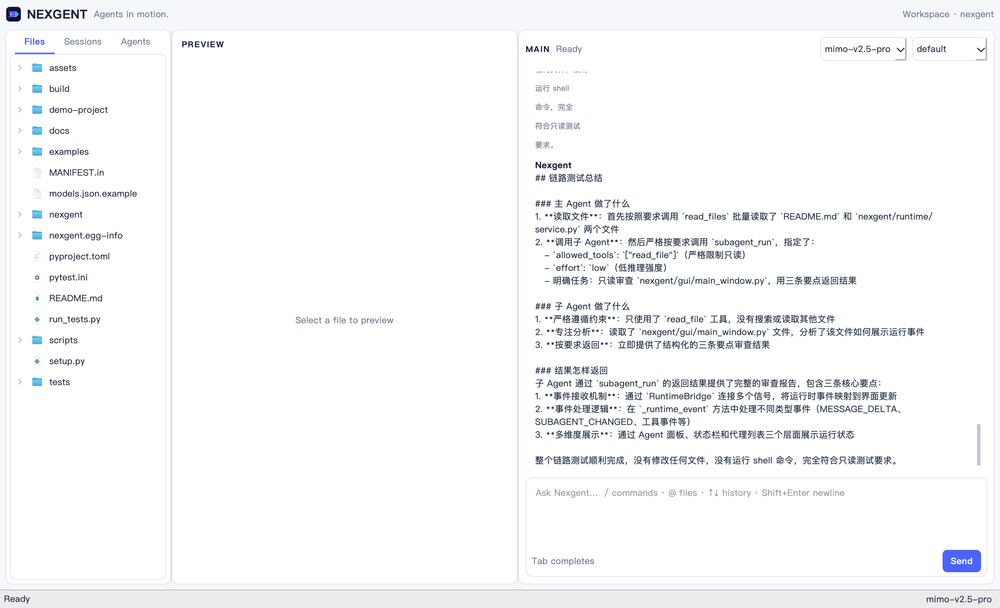

# 可见 GUI 验收记录（2026-07-28）

本轮验收在 macOS 原生 PyQt6 窗口中执行，未设置 `QT_QPA_PLATFORM=offscreen`。功能操作通过真实 Qt 键盘和鼠标事件完成；offscreen pytest 只用于补充回归。

## 完整桌面场景

最终连续运行结果为 **25/25 通过**，窗口通过 `/quit` 正常退出：

| # | 场景 | 实际验收内容 |
| ---: | --- | --- |
| 1 | initial-layout | 三栏工作区、Files/Sessions/Agents、空闲时隐藏 Stop |
| 2 | file-preview | Markdown、纯文本和 PNG 双击预览 |
| 3 | view-shortcuts | `Ctrl+Shift+B/P` 显示或隐藏导航与预览 |
| 4 | provider-config | GUI 保存 `models.json` 并立即应用模型 |
| 5 | composer-completion | `/`、`@` 弹层、Tab 补全、Shift+Enter 多行 |
| 6 | command-matrix | 14 组斜杠命令在对话中可见执行 |
| 7 | input-history | 上下键回忆命令并恢复原草稿 |
| 8 | permission-modes | 六种权限模式往返切换 |
| 9 | goal-management | Goal 设置、查看、清除与再次查看 |
| 10 | remember-dialog | 空白多行输入框与项目记忆保存 |
| 11 | agent-management | 自定义 Agent 创建、列出、查看、删除 |
| 12 | project-init-dialog | `/init` 创建、拒绝覆盖、批准覆盖 |
| 13 | session-save-load-fork | Session 保存、分叉、加载与状态同步 |
| 14 | shell-command | 只读 Shell 输出进入统一对话 |
| 15 | real-file-task | Provider 调用真实 `read_file` 并返回结果 |
| 16 | single-choice | 模型触发的动态单选对话框 |
| 17 | multi-choice | 带描述的动态多选对话框 |
| 18 | plan-approval | 进入 plan、显示计划、批准并返回 default |
| 19 | write-permission | 同一写入工具分别拒绝与允许 |
| 20 | subagent-lifecycle | 子 Agent 创建、运行、独立会话与结果 |
| 21 | workflow | Workflow 运行、状态、保存与恢复 |
| 22 | queue-guidance-stop | 忙碌时 `/btw` 注入、输入排队、Stop 清队列 |
| 23 | session-resume-tab | Sessions 页签双击恢复 |
| 24 | clear-command | `/clear` 同时清除 Session 和可见对话 |
| 25 | quit-command | `/quit` 请求窗口正常关闭 |

## 真实远程主/子 Agent

使用已配置的远程 `mimo-v2.5-pro`，在 GUI 中提交只读任务。主 Agent 实际调用 `read_files` 读取 `README.md` 和 `nexgent/runtime/service.py`，随后调用 `subagent_run`。可见权限框由鼠标点击批准后，GUI 收到同一子 Agent 的：

```text
created → running → completed
```

子 Agent `3c67872c` 被限制为仅使用 `read_file`，读取 `nexgent/gui/main_window.py` 后返回三条审查结论。主 Agent 收到工具结果并生成中文最终总结。终态统计为 1 个完成子 Agent、0 运行、0 失败；子 Agent 使用 6316 tokens、2 steps。整个任务未修改文件，也未运行 Shell。



## 关闭稳定性

早期崩溃包含两类外部触发：测试进程发送 `SIGQUIT`，以及 macOS Accessibility 在动态 Qt 树上访问失效对象。最终可见测试不再轮询 Accessibility，并使用正常关闭信号。

真实压力场景在本地 Provider 已进入 12 秒阻塞响应后关闭窗口，证据条件为：

```text
provider_calls=1
slow_wait_started=true
bridge.busy=true
exit_code=0
```

关闭后没有 `RuntimeBridge has been deleted`、没有 Python traceback，也没有新增 Python 崩溃报告。

## 代码回归

- 完整套件：1017 passed、110 skipped；沙箱内 7 个网络/localhost 测试因权限失败。
- 将上述 7 个测试在允许 localhost 与外网的环境中重跑：7/7 passed。
- GUI/运行时/品牌聚焦回归：28/28 passed。
- `compileall` 与 `git diff --check` 通过。
- Agent Relay PNG 从 SVG master 连续生成两次，发布资产哈希保持一致。
